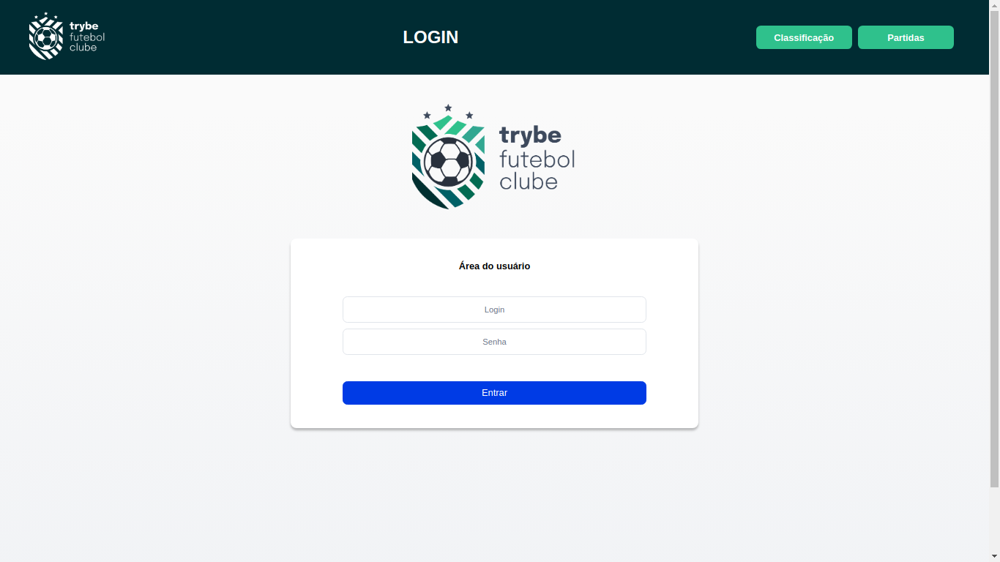
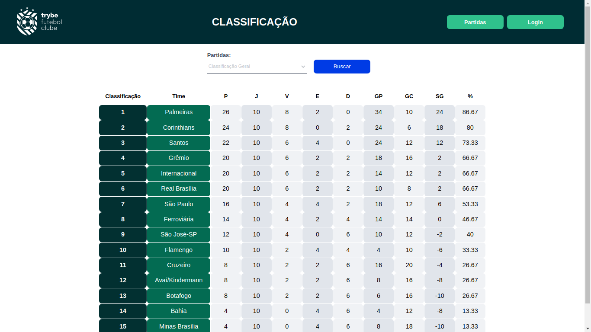
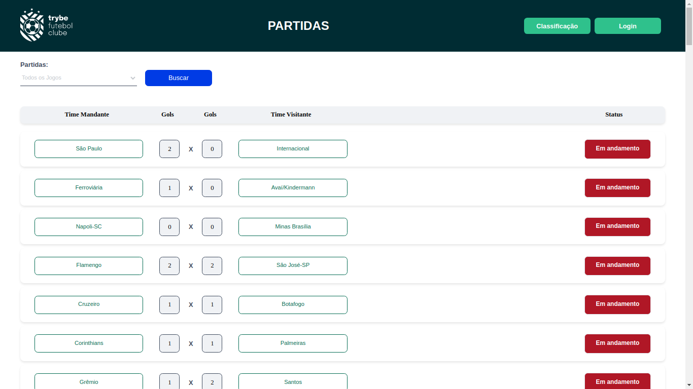

# Projeto Trybe Futebol Clube 
[](https://github.com/FabricioAnastacio/projeto-TrybeFutebolClube/blob/main/LICENSE) 

# Sobre o projeto

Esse é um projeto FullStack desenvolvido utilizando a linguagem TypeScript em conjunto com JavaScript.

- Em `BackEnd` foi utilizado `TypeScript`. Minha participação esta composta 100% na pasta _app/backend/src_, os demais arquivos foram desenvovidos pela Trybe.
- Em `FrontEnd` foi utilizado `JavaScript` e todo o seu desenvolvimento foi feito pela Trybe.
- Apenas o arquivo `Dockerfile` em ambas foram de autoria minha.

O aplicativo TFC é um site informativo sobre partidas e classificações de futebol! ⚽️

## Layout web






## Modelo conceitual


# Tecnologias utilizadas
## Back end
* Arquitetura em camadas
* Teste em camadas
* ORM - `Sequelize`
* Banco de dados realacional - `MySQL`
* Conteinerização - `Docker`
* Atenticação - `JWT`

## Front end
- Interamente desenvolvido pela Trybe

# Como executar o projeto

Este projeto roda com o Docker então sera necessario apenas alguns comandos para rodar a aplicação com containers:

```bash
# clonar repositório
git clone git@github.com:FabricioAnastacio/projeto-TrybeFutebolClube.git

# entrar na pasta do projeto
cd app

# executar o projeto
docker compose up -d --build && cd backend && npm run db:reset && cd ..
```
Feito isso a palicação ja vai estar rodando na porta 3000. Podara acessa-la pelo link http://localhost:3000/

*Para fechar a aplicação é simples:*

```bash
# entrar na pasta do projeto
cd app

# fechar a aplicação
docker compose down
```

# Autor

Fabricio Anastacio Rodrigues

[](https://www.linkedin.com/in/far-dev/)
